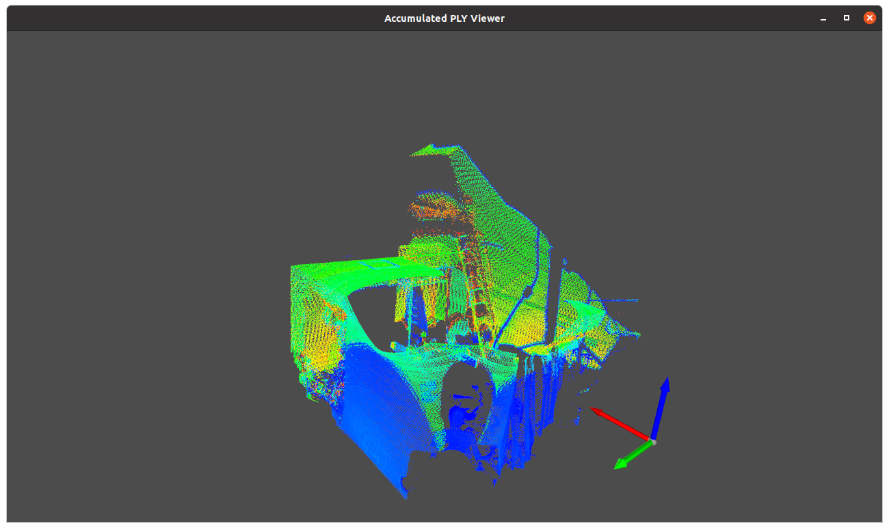

# Livox LVX2 to PLY Conversion and Visualization Tools

This repository provides Python tools for converting Livox LVX2 files to PLY format and visualizing point cloud data.

## Overview

The toolset consists of four main components:

1. **LVX2 to PLY Converter**: Converts Livox LVX2 files to sequential PLY files
2. **PLY Sequence Viewer**: Visualizes a sequence of PLY files with options for looping and cumulative display
3. **PLY Viewer**: Simple viewer for a single PLY file
4. **PLY Viewer Cumulative Frame**: Visualizes accumulated point clouds from a specified range of frames

## Requirements

Install the required dependencies:

```bash
pip install -r requirements.txt
```

Dependencies:
- numpy
- open3d
- laspy
- plyfile

## Usage

### LVX2 to PLY Converter

Convert Livox LVX2 files to sequential PLY files:

```bash
python convert_lvx2_to_ply.py -i input.lvx2 -o ./output_ply
```

Options:
- `-i, --in_file`: Input LVX2 file (required)
- `-o, --out_dir`: Output directory for PLY files (default: "output_ply")
- `--prefix`: Prefix for output filenames (default: "frame")
- `--start`: Start frame index (inclusive, default: 0)
- `--end`: End frame index (inclusive, -1 for all frames, default: -1)
- `--step`: Frame step (1 = every frame, 2 = every other, etc., default: 1)

Examples:
```bash
# Convert all frames in LVX2 file to PLY files
python convert_lvx2_to_ply.py -i data.lvx2 -o ./output_ply

# Convert only frames 10-50 with custom prefix
python convert_lvx2_to_ply.py -i data.lvx2 -o ./output_ply --prefix cloud --start 10 --end 50

# Convert every 5th frame
python convert_lvx2_to_ply.py -i data.lvx2 -o ./output_ply --step 5
```

### PLY Sequence Viewer

Visualize a sequence of PLY files with options for looping and cumulative display:

```bash
python ply_sequence_viewer.py -i ./output_ply
```

Options:
- `-i, --input-ply-dir`: Directory containing PLY files (required)
- `-l, --loop`: Loop playback of point cloud sequence
- `-c, --cumulative`: Accumulate point clouds over time

Examples:
```bash
# Basic visualization of PLY sequence
python ply_sequence_viewer.py -i ./output_ply

# Loop the sequence
python ply_sequence_viewer.py -i ./output_ply -l

# Accumulate point clouds over time
python ply_sequence_viewer.py -i ./output_ply -c

# Loop and accumulate (accumulation resets after each loop)
python ply_sequence_viewer.py -i ./output_ply -l -c
```

### PLY Viewer

Simple viewer for a single PLY file:

```bash
python ply_viewer.py -i ./output_ply/frame_000000.ply
```

Options:
- `-i, --input-ply`: Path to the input PLY file (required)

### PLY Viewer Cumulative Frame

Visualize accumulated point clouds from a specified range of frames:

```bash
python ply_viewer_cumulative_frame.py -i ./output_ply
```

Options:
- `-i, --input-ply-dir`: Directory containing PLY files (required)
- `--start`: Start frame number (inclusive, default: 0)
- `--end`: End frame number (inclusive, -1 for all frames, default: -1)
- `--jet-colormap`: Use jet colormap for visualization

Examples:
```bash
# Visualize all frames with grayscale intensity
python ply_viewer_cumulative_frame.py -i ./output_ply

# Visualize frames 10-50 only
python ply_viewer_cumulative_frame.py -i ./output_ply --start 10 --end 50

# Visualize all frames with jet colormap
python ply_viewer_cumulative_frame.py -i ./output_ply --jet-colormap
```

A screenshot of the ply_viewer_cumulative_frame.py output can be found at .

## Key Features

- Direct conversion from LVX2 to PLY without requiring ROS
- Support for reflectivity/intensity visualization
- Multiple visualization options (single frame, sequence, cumulative)
- Jet colormap visualization for better intensity discrimination
- Frame range selection for targeted analysis

## Acknowledgments

The LVX2 file parsing code was inspired by [lvx2_to_rosbag](https://github.com/DHA-Tappuri/lvx2_to_rosbag) (BSD-3-Clause license).

## References

- Livox LVX2 file format specifications: [LVX2 Specifications.pdf](https://terra-1-g.djicdn.com/65c028cd298f4669a7f0e40e50ba1131/LVX2%20Specifications.pdf)
